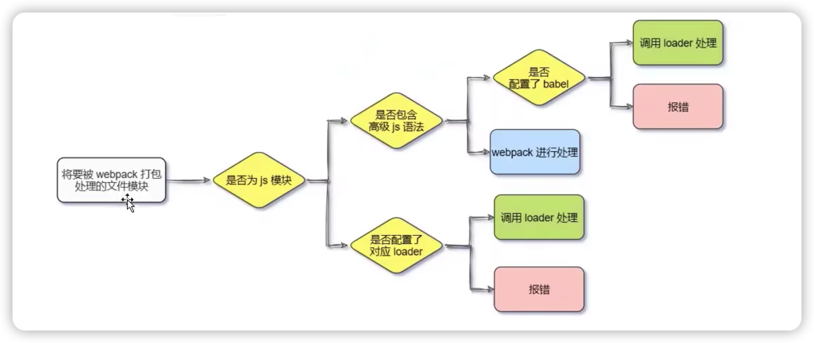

bibi 地址：https://www.bilibili.com/video/BV1zq4y1p7ga/

# Vue 基础-00 课程介绍

## 使用人群

- 对 Vue 框架**感兴趣**
- 前端在职，**有进一步提升需求**
- 希望**快速入门 Vue 开发**的相关人员

## 前置储备

- 必要前提：

  - HTML + CSS + JavaScript
  - WebAPI (DOM + BOM)
  - Ajax

- 可选前提：
  - Node.js

## 第一天：前端工程化和 Webpack

- 前端工程化的相关概念
- Webpack 的常见用法
- 打包发布
- Source Map

**目标：**

- 了解工程化的前端开发方式
- 能够知道 Webpack 在实际开发中所起到的作用

## 第二天：Vue 基础入门-part1

- Vue 的基础使用步骤
- Vue 中常用的指令
- vue-devtools 调试工具

**目标：**

- 能够使用 Vue 的指令完成页面结构的渲染
- 能够使用 Vue 的调试工具辅助 Vue 的开发

## 第三天：Vue 基础入门-part2

- 过滤器和侦听器
- 计算属性的用法
- axios 的基本语法
- vue-cli 的安装和使用

**目标：**

- 能够在实际开发中合理运用过滤器，侦听器，计算属性解决自己遇到的问题
- 能够使用 axios 发起 Ajax 请求
- 能够使用 vue-cli 工具生成工程化的 Vue 项目

## 第四天：组件与生命周期

- 组件的注册与使用
- 组件的 props 自定是属性
- 解决组件样式冲突
- 组件的生命周期
- 组件之间的通讯（数据共享）

**目标：**

- 能够掌握 .vue 单文件组件的基本用法
- 能够掌握组件通讯的三种方式
- 掌握组件生命周期的只想顺序和应用场景

## 第五天：ref & 购物车案例

- 使用 ref 引用 DOM 元素和组件实例
- $nextTick 的基本使用
- 购物车案例

**目标：**

- 能够使用 ref 获取页面上 DOM 或组件的引用
- 能够知道 $nextTick 的应用场景并合理地使用
- 通过 “购物车案例”巩固前 4 天所有学的知识

## 第六天：Vue 组件的高级用法

- 动态组件的使用
- 插槽的使用（默认插槽，具名插槽，作用域插槽）
- 自定义指令
- ESlint 的使用

**目标：**

- 能够使用 keep-alive 实现组件的缓存
- 能够使用插槽提升组件的复用性
- 能够了解常见的 ESlint 语法规则

## 第七天：路由（vue-router）

- 路由的基本配置与使用
- 路由重定向
- 嵌套路由，动态路由
- 编程式导航，路由导航守卫

**目标：**

- 能够在项目中安装和配置路由
- 能够使用路由实现单页面应用程序的开发
- 能够使用导航守卫控制路由的访问权限

## 第八天：黑马头条（收尾案例）

- Vant 组件库
- 封装 axios
- 上拉加载 & 下拉刷新
- Vant 主题定制

**目标：**

- 掌握 Vant 组件库的基本使用
- 能够知道如何封装 axios 请求模块
- 能够知道如何实现上拉加载和下拉刷新功能

# Vue 2.0-01 学习目标

## webpack 的学习目标

- 理解什么是前端工程化

  - 转变对前端开发的认知

- 了解 webpack 的基本用法

  - 为后面 Vue 和 React 课程的学习做技术储备

- 不强求要求大家能手动配置 webpack
  - 一定要知道 webpack 在项目中有什么作用
  - 清楚 webpack 中的核心概念

# Vue 2.0-02 工程化的概念

## 1. 小白眼中的前端开发 vs 实际的前端开发

**小白眼中的前端开发：**

- 会写 HTML + CSS + JavaScript 就会前端开发
- 需要美化页面的样式，就拽一个 bootstrap 过来
- 需要操作 DOM 或发起 Ajax 请求，再拽一个 JQuery 过来
- 需要快速实现网页布局效果，就拽一个 Layui 过来

**实际的前端开发：**

- **工程化**（js 的模块化，css 的模块化，资源的模块化）
- **组件化**（复现现有的 UI 结构，样式，行为）
- **规范化**（目录结构的划分，编程规范化，接口规范化，文档规范化，Git 分支管理）
- **自动化**（自动化构建，自动部署，自动化测试）

## 2. 什么是前端工程化

前端工程化指的是：在**企业级的前端项目开发**中，把前端开发所需的**工具**，**技术**，**流程**，**经验**等进行规范化，标准化

企业中的 Vue 项目和 React 项目，都是基于**工程化的方式**进行开发的

好处：前端开发**自成体系**，有一套**标准的开发方案和流程**

## 3. 前端工程化的解决方案

**早期的前端工程化解决方案：**

- grunt（https://www.gruntjs.net/）
- gulp （https://www.gulpjs.com.cn/）

**目前主流的前端工程化解决方案：**

- webpack（https://webpack.docschina.org/）
- parcel（https://parceljs.org/）

# Vue 2.0-03 了解 webpack 的概念

## 1. 什么是 webpack

概念：webpack 是**前端工程化的具体解决方案**

主要功能：它提供了友好的**前端模块化开发**支持，以及**代码压缩混淆**，**处理浏览器端 JavaScript 的兼容性**，**性能优化**等强大的功能

好处：让程序员把**工作的重心**放到具体功能的实现上，提高了前端**开发效率**和项目的**可维护性**。

# Vue 2.0-04 webpack 基础-初始化隔行变色的案例

## 2. 创建列表隔行变色项目

- 新建项目空白目录，并运行 npm init -y 命令，初始化包管理配置文件 package.json
- 新建 src 源代码目录
- 新建 src -> index.html 首页和 src -> index.js 脚本文件
- 初始化首页基本得结构
- 运行 npm install jquery -S 命令，安装 JQuery
- 通过 ES6 模块化得方式导入 JQuery ，实现列表隔行变色效果

# Vue 2.0-05 webpack 基础-安装和配置 webpack

## 3. 在项目中安装 webpack

在终端运行如下的命令，安装 webpack 相关的两个包：

npm install webpack@5.42.1 webpack-cli@4.7.2 -D

-S 是 --save 的简写

-D 是 --save-dev 的简写

## 4. 在项目中配置 webpack

（1）在项目根目录中，创建名为 **webpack.config.js** 的 webpack 配置文件，并初始化如下的基本配置：

```
// 使用 Node.js 中的导出语法，向外导出一个 webpack 的配置对象
module.exports = {
  mode: 'development',  // mode 用来指定构建模式，可选值有 development 和 production
}
```

（2）在 package.json 的 scripts 节点下，新增 **dev 脚本**如下：

```
  "scripts": {
    "dev": "webpack" // scripts 节点下的脚本，可以通过 npm run 执行，例如 npm run dev
  },
```

（3）在终端中运行 npm run dev 命令，启动 webpack 进行项目的打包构建

# Vue 2.0-06 webpack 基础-了解 mode 可选值的应用场景

## 4.1 mode 的可选值

mode节点的可选值有两个，分别是：

- **development**
  - **开发环境**
  - **不会**对打包生成的文件进行**代码压缩**和**性能优化**
  - 打包**速度快**，适合在**开发阶段**使用

- **production**
  - **生产环境**
  - **会**对打包生成的文件进行**代码压缩**和**性能优化**
  - 打包**速度慢**，仅适合在项目**发布阶段**使用

# Vue 2.0-07 指定 webpack 的 entry 和 output

## 4.2 webpack.config.js 文件的作用

webpack.config.js 是 webpack 的配置文件。webpack 在真正开始打包构建之前，会**先读取这个配置文件**，从而基于给定的配置，对项目进行打包

注意：由于 webpack 是**基于 node.js 开发出来**的打包工具，因此在它的配置文件中，支持使用 node.js 相关的语法和模块进行 webpack 的个性化配置。

## 4.3 webpack 中的默认约定

在 webpack 4.x 和 5.x 的版本中，有如下的默认约定：

- 默认的打包入口文件为 **src** -> **index.js**
- 默认的输出文件路径为 **dist** -> **main.js**

注意：可以在 **webpack.config.js** 中修改打包的默认约定

## 4.4 自定义打包的入口与出口

在 webpack.config.js 配置文件中，通过 **entry 节点**指定**打包的入口**。通过 **output 节点**指定**打包的出口**。

示例代码如下：

```
const path = require('path')  //导入 node.js 中专门操作路径的模块

// 使用 Node.js 中的导出语法，向外导出一个 webpack 的配置对象
module.exports = {
  entry: path.join(__dirname, './src/index.js'),  //打包入口文件的路径
  output: {
    path: path.join(__dirname, './dist'),  // 输出文件的存放路径
    filename: 'bundle.js',  // 输出文件名称
  }
}
```

# Vue 2.0-08 插件 安装和配置webpack-dev-server 这个插件

## 1. webpack 插件的作用

通过安装和配置第三方的插件：可以**拓展 webpack 的能力**，从而让 webpack **用起来更方便**。最常用的 webpack 插件有如下两个：

- **webpack-dev-server**
  - 类似于 node.js 阶段用到的 nodemon 工具
  - 每当修改了源代码， webpack 会自动进行项目的打包和构建


- **html-webpack-plugin**
  - webpack 中的 HTML 插件（类似于一个模版引擎插件）
  - 可以通过此插件自定制 index.html 页面的内容

## 2.1 安装 webpack-dev-server

运行如下的命令，即可在项目中安装此插件：

npm install webpack-dev-server@3.11.2 -D

## 2.2 配置 webpack-dev-server

- 修改 **package.json** -> **scripts** 中的 **dev** 命令如下：

```
"scripts": {
    "dev": "webpack serve",  // script节点下的脚本，可以通过 npm run 执行
  },
```

- 再次运行 **npm run dev** 命令，重新进行项目的打包
- 在浏览器中访问 **http://localhost:8080** 地址，查看自动打包效果

注意：webpack-dev-server 会启动一个**实时打包的 http 服务器**

# Vue 2.0-09 插件 介绍 webpack-dev-server 的工作原理

# Vue 2.0-10 插件 安装和配置 html-webpack-plugin 这个插件

## 3.1 安装 html-webpack-plugin

运行如下的命令，即可在项目中安装此插件

npm install html-webpack-plugin@5.3.2 -D

## 3.2 配置 html-webpack-plugin

```
// 1. 导入 HTML 插件，得到一个构造函数
const HtmlPlugin = require('html-webpack-plugin')

// 2. 创建 HTML 插件的实例对象
const htmlPlugin = new HtmlPlugin({
  template: './src/index.html',  // 指定原文件的存放路径
  filename: './index.html',  // 指定生成的文件的存放路径
})

module.exports = {
  mode: 'development',
  plugins: [htmlPlugin],  // 3. 通过 plugins 节点，使 htmlPlugin 插件生效
}
```

# Vue 2.0-11 插件 了解 html-webpack-plugin 插件的特性

## 3.3 解惑 html-webpack-plugin

- 通过 HTML 插件复制到项目根目录的 index.html 页面，**也被放到了内存中**
- HTML 插件在生成的 index.html **页面**，**自动注入**了打包的 bundle.js 文件

# Vue 2.0-12 插件 了解 devServer 中常用的选项

## 4. devServer 节点

在 webpack.config.js 配置文件中，可以通过 **devServer** 节点对 webpack-dev-server 插件进行更多的配置，示例代码如下：

```
devServer: {
    open: true,  // 初次打包完成后，自动打开浏览器
    host: '127.0.0.1',  // 实时打包所使用的主机地址
    // 在 http 协议中，如果端口号是80，则可以被省略
    port: 3000,  // 实时打包所使用的端口号
  }
```

注意：凡事修改了 webpack.config.js 配置文件，或修改了 package.json 配置文件，**必须重启实时打包的服务器**，否则最新的配置文件无法生效！

# Vue 2.0-13 loader 说明 loader的作用

## 1. loader 概述

在实际开发过程中， webpack 默认只能打包处理以 .js 后缀名结尾的模块。其他**非 .js 后缀名结尾的模块**，webpack 默认处理不了，**需要调用loader 加载器才可以正常打包**，否则会报错！

loader 加载器的作用： **协助 webpack 打包处理特定的文件模块**。比如：

- css-loader 可以打包处理 .css 相关的文件
- less-loader 可以打包处理 .less 相关的文件
- babel-loader 可以打包处理 webpack 无法处理的高级 JS 语法

## 2. loader 的调用过程



## 3. 打包处理 css 文件

- 运行 **npm i style-loader@3.0.0 css-loader@5.2.6 -D** 命令，安装处理 css 文件的 loader
- 在 webpack.config.js 的 **module** -> **rules** 数组中，添加 loader 规则如下：

```
module: {  //所有第三方文件模块的匹配规则
  rules: [  //文件后缀名的匹配规则
    {test: /\.css$/, use: ['style-loader', 'css-loader']}
  ]
}
```

其实， **test** 表示匹配的**文件类型**，**use** 表示对应**要调用的 loader**

注意：

- use 数组中指定的 loader **顺序是固定的**
- 多个 loader 的调用顺序是：**从后往前调用**